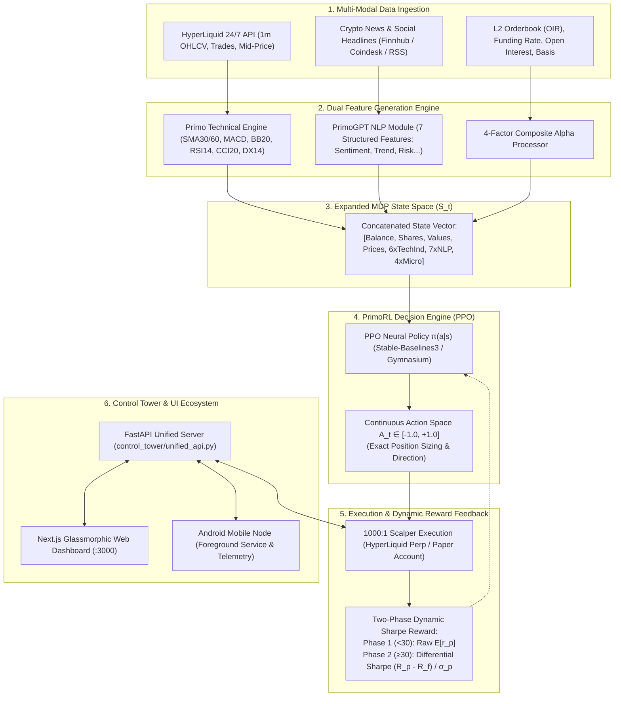

# System Patterns — HyperNova + Primo AI Architecture

## Unified Architecture: "Primo-Enhanced Deep Reinforcement Learning Engine"

The HyperNova architecture integrates Primo's academic state-of-the-art DRL pipeline (Botunac et al., 2025) with HyperLiquid's sub-second crypto microstructure feeds and institutional 1000:1 execution.

---

## Key System Patterns

### 1. Dual Feature Representation (State Vector S_t)
- **Quantitative Vector**:
  - $SMA_{30}$, $SMA_{60}$ (Long-term Trend)
  - $MACD_{12,26,9}$ (Momentum & Convergence)
  - $Bollinger_{20,2.0}$ (Volatility bands)
  - $RSI_{14}$ (Exponential smoothed momentum)
  - $CCI_{20}$ (Mean Absolute Deviation cycles)
  - $DX_{14}$ (Directional Movement strength)
- **Qualitative Vector (PrimoGPT 7 Features)**:
  - `news_relevance` $[0..2]$, `sentiment` $[-1..1]$, `price_impact` $[-3..3]$, `trend_direction` $[-1..1]$, `earnings_impact` $[-2..2]$, `investor_confidence` $[-3..3]$, `risk_profile_change` $[-2..2]$.
- **Microstructure Vector**:
  - `L2 OIR` $[-100..100]$, `Funding Rate APR`, `Open Interest`, `Basis Premium`.

### 2. Continuous Policy Execution
- Unlike discrete buy/hold/sell frameworks, PrimoRL outputs a scalar $A_t \in [-1.0, 1.0]$.
- Position size is computed smoothly:
  $$\text{Target Position} = \text{round}\left(A_t \times \frac{\text{Max Notional USD}}{\text{Current Price}}\right)$$

### 3. Dynamic Two-Phase Sharpe Ratio Reward
- **Warmup Phase ($t < 30$)**: Uses raw portfolio returns $E[r_p]$ to avoid statistical instability on small sample sizes.
- **Adaptive Risk Phase ($t \ge 30$)**: Switches to rolling Sharpe Ratio $(R_p - R_f)/\sigma_p$ ensuring the agent prioritizes risk-adjusted consistency over volatile gambles.

### 4. Zero-Leakage Architecture
- Strict separation between training data and inference state.
- During live execution, PrimoGPT only parses current news with zero look-ahead bias.
