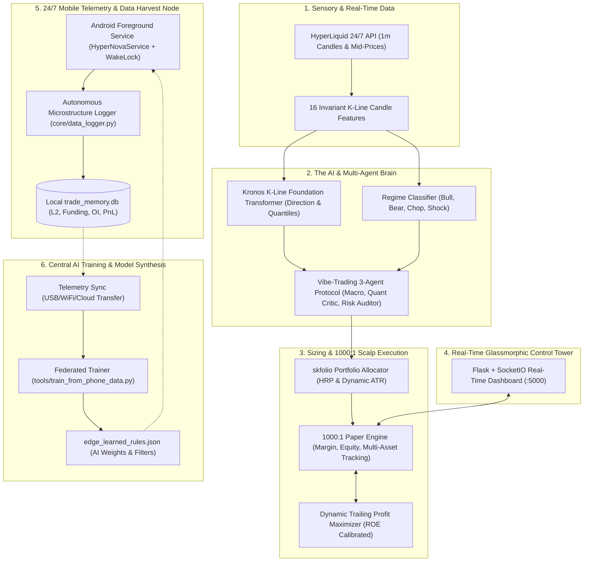

# System Patterns

## System Architecture: "Next-Gen Institutional Hybrid Engine"

The HyperNova architecture integrates institutional quantitative portfolio theory, K-line foundation transformers, multi-agent debate protocols, and a sub-second 1000:1 leverage execution loop.

### Core Components
1. **Sensory System & Feature Ingestion:**
   - Real-time 1m candle fetching from HyperLiquid with in-memory caching.
   - Extracts 16 scale-invariant candle features for the foundation transformer.
2. **The Brain (Kronos + Vibe-Trading + Regime Classifier):**
   - **Kronos Foundation Model**: PyTorch transformer evaluating raw candle geometry without scale dependencies.
   - **Regime Classifier**: Determines Bull/Bear/Chop/Shock using ADX, EMA ribbons, and ATR ratios.
   - **Vibe-Trading Protocol**: Multi-agent consensus gating before risk is committed.
3. **Institutional Allocator (`skfolio`):**
   - Implements Hierarchical Risk Parity (HRP) and CVaR optimization for multi-asset risk balancing.
4. **1000:1 Execution Engine & Dynamic Profit Maximizer:**
   - **Micro-Margin Math**: $800 Notional uses $0.80 Margin per trade.
   - **Dynamic Trailing**: Winning trades (`+%0.07` / `+%70 ROE`) are never cut by time, riding trends until a 0.03% pullback occurs.
   - **Dead-Weight Timeout**: Stagnant trades are cleared at 2.5 minutes.
5. **Real-Time Control Tower:**
   - Flask + SocketIO streaming multi-asset prices, 6-metric position cards, ROE %, and auto-refreshing trade history.
6. **Mobile Edge Node & Telemetry Harvester:**
   - **Zero-Setup Cloud Build**: Derives APKs via GitHub Actions / Colab CI/CD, eliminating the need for heavy local Android Studio installations.
   - **24/7 Phone Data Collection**: Operates as a persistent Android Foreground Service, capturing orderbook imbalances (OIR), funding rates, and trade telemetry into `trade_memory.db`.
   - **Feedback & Rule Refinement**: Telemetry from mobile devices is synced to PC to train `edge_learned_rules.json`, continuously boosting bot win rate.
